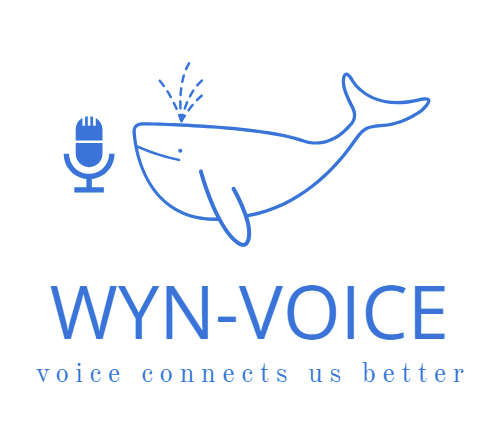

# Wyn Voice: A Conversational AI and Audio Processing Library



## Introduction and Motivation
🎙️ **WYN-Voice** is a Python library designed to simplify the process of creating conversational AI applications that leverage OpenAI's GPT models. 🤖 The library provides an easy-to-use interface for generating responses to user inputs and includes functionality for recording and processing audio, 🎧 making it suitable for building interactive voice-based applications. 🗣️
## Directory Structure
The project directory is organized as follows:

```
.
├── pyproject.toml
├── README.md
└── wyn_voice
    └── chat.py
```

- `pyproject.toml`: Contains the project's dependencies and other configuration settings.
- `README.md`: This file, providing an overview and usage instructions.
- `wyn_voice`: A folder containing the main library code.
  - `chat.py`: The script defining the `ChatBot` and `AudioProcessor` classes.

## Example Usage
To get started with Wyn Voice, follow these steps:

### Installation
First, install the necessary packages using pip:

```bash
pip install wyn-voice pyautogen pydub openai
```

### Using the ChatBot Class
The `ChatBot` class allows you to interact with OpenAI's GPT models to generate responses based on user input.

```python
from wyn_voice.chat import ChatBot

# Initialize the ChatBot with your OpenAI API key
api_key = 'your-openai-api-key'
chatbot = ChatBot(api_key)

# Generate a response from the chatbot
prompt = "Hello, how are you?"
response = chatbot.generate_response(prompt)
print("ChatBot:", response)

# Retrieve the conversation history
history = chatbot.get_history()
print("Conversation History:", history)
```

### Using the AudioProcessor Class
The `AudioProcessor` class provides functionality to record audio, process it, and interact with the `ChatBot`.

```python
from wyn_voice.chat import ChatBot, AudioProcessor

# Initialize the ChatBot with your OpenAI API key
api_key = 'your-openai-api-key'
chatbot = ChatBot(api_key)

# Initialize the AudioProcessor with the ChatBot
audio_processor = AudioProcessor(chatbot)

# Record audio and generate a response
transcript = audio_processor.process_audio_and_generate_response()
print("Transcript:", transcript)

# Record audio and get the transcribed text
text = audio_processor.voice_to_text()
print("Transcribed Text:", text)

# Convert text to speech and save it as an mp3 file
response_text = "This is a test response."
output_file = audio_processor.text_to_voice(response_text)
print("Saved audio response to:", output_file)

# Play the saved audio file
audio_processor.play_audio(output_file)
```

### Using the ChatEnvironment Class
The `ChatEnvironment` class allows you to create a conversation environment to interact with `ChatBot` using voice command.

```python
from wyn_voice.chat import ChatBot, AudioProcessor, ChatEnvironment
from google.colab import userdata
OPENAI_API_KEY = userdata.get('OPENAI_API_KEY')

# Create instances of ChatBot and AudioProcessor
chatbot = ChatBot(
    api_key=OPENAI_API_KEY,
    protocol="You are a live translator."
    "When you hear Chinese, speak English."
    "When you hear English, speak Chinese.")
audio_processor = AudioProcessor(chatbot)

# Create an instance of ChatEnvironment
chat_env = ChatEnvironment(chatbot, audio_processor)

# Start the chat loop
chat_env.start_chat(exit_command="Exit the program")
```

## Author
Yiqiao Yin

## Site
[https://www.y-yin.io/](https://www.y-yin.io/)
